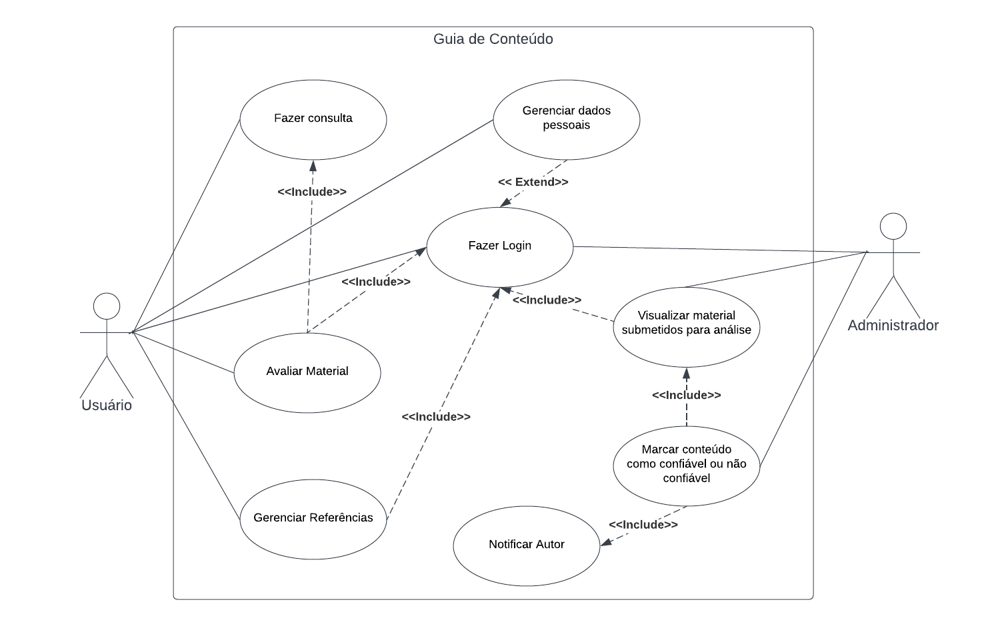

# Especificações do Projeto

Pré-requisitos: <a href="1-Documentação de Contexto.md"> Documentação de Contexto</a>

Definição do problema e ideia de solução a partir da perspectiva do usuário. É composta pela definição do diagrama de personas, histórias de usuários, requisitos funcionais e não funcionais além das restrições do projeto.

Apresente uma visão geral do que será abordado nesta parte do documento, enumerando as técnicas e/ou ferramentas utilizadas para realizar a especificações do projeto

## Personas

## Personas

|                     | Nome | Idade | UF                            | Motivação              |
| ------------------- | ---- | ----- | ----------------------------- | ---------------------- |
|  | Zoe  | 32    | MG                            | Transição de Carreira. |
|  | Sol  | 18    | SP                            | Cursos de Scrum        |
| Gabriel             | 27   | SP    | Cursos de Back-end            |
| Caio                | 19   | MG    | Cursos de Front-end           |
| Ravi                | 36   | MG    | Divulgar aulas de programação |
| Letícia             | 18   | SC    | Cursos de línguas             |

| Persona | Dificuldades                                                                                                                                                   | Em relação ao projeto                                                                                                                                 |
| ------- | -------------------------------------------------------------------------------------------------------------------------------------------------------------- | ----------------------------------------------------------------------------------------------------------------------------------------------------- |
| Zoe     | É Advogada mas deseja fazer transição de carreira e começar na área de programação, mas tem muita dificuldade em achar cursos de confiança.                    | Espera encontrar conteúdos confiáveis, através desta aplicação.                                                                                       |
| Sol     | É júnior como Scrum Master em uma empresa de tecnologia e quer conseguir subir na carreira, procurando cursos onde poderia estudar para certificação de Scrum. | Ele acredita que uma plataforma com cursos onde pessoas dizem se é útil ou não, seria melhor para escolher os cursos certos a se fazer para sua área. |
| Gabriel | É front-end pleno, mas está querendo aprender mais sobre Back-end e se tornar fullstack.                                                                       | Tem muita dificuldade de sair procurando cursos, por isso uma aplicação com várias opções de curso ajudaria muito na escolha.                         |
| Caio    | Estudante do curso de análise e desenvolvimento de sistemas, gostaria de conseguir um estágio como Front-end.                                                  | Gostaria de uma plataforma onde indica cursos de REACT de forma gratuita e de confiança, para melhorar seu desempenho como Front-end.                 |
| Ravi    | Professor de ensino superior que quer divulgar suas aulas de programação                                                                                       | Não sabe por onde começar, por isso procura uma plataforma para divulgar suas aulas                                                                   |
| Letícia | Está cursando o ensino médio e se preparando para o enem. Mas está encontrando dificuldade em Língua inglesa.                                                  | Diz que tem muitas opções de estudo mas não sabe separar o que tem qualidade e o que não tem.                                                         |

## Histórias de Usuários

Com base na análise das personas foram identificadas as seguintes histórias de usuários:

| EU COMO... `PERSONA` | ...QUERO/PRECISO ... `FUNCIONALIDADE`                                                                          | ...PARA ... `MOTIVO/VALOR`                                                           |
| ----------------------- | ----------------------------------------------------------------------------------------------------------------- | --------------------------------------------------------------------------------------- |
| Zoe                     | Encontrar os melhores cursos de programação para iniciantes                                                       | Poder conhecer a área e encontrar materiais mais bem avaliados                          |
| Sol                     | Achar cursos de Scrum com certificações                                                                           | Para evoluir profissionalmente                                                          |
| Gabriel                 | Achar cursos back-end de carga horária curta e em português                                                       | Se tornar um profissional mais completo                                                 |
| Caio                    | Achar cursos de desenvolvimento front-end com profissionais gabaritados e cursos confiáveis com uma boa avaliação | Capacitar-se no mundo do desenvolvimento front-end através de cursos de React gratuitos |
| Ravi                    | Quer divulgar suas aulas em uma plataforma segura de forma que facilite a exposição de seu material               | Alcançar o maior numero de alunos e assim divulgar mais sobre o mundo da programação    |
| Letícia                 | Encontrar cursos de inglês básicos para o ENEM                                                                    | Buscar os conteúdos mais enxutos sobre Inglês modelo ENEM                               |

## Requisitos

As tabelas que se seguem apresentam os requisitos funcionais e não funcionais que detalham o escopo do projeto.

### Requisitos Funcionais

| ID     | Descrição do Requisito                                                                                                                                                                                                         | Prioridade |
| ------ | ------------------------------------------------------------------------------------------------------------------------------------------------------------------------------------------------------------------------------ | ---------- |
| RF-001 | A aplicação deve possibilitar um usuário, cadastrado ou não, possa realizar pesquisa de material para estudo.                                                                                                                  | ALTA       |
| RF-002 | A aplicação deve oferecer uma funcionalidade de filtro de pesquisa do material de forma especifica para usuários cadastrado ou não.                                                                                            | ALTA       |
| RF-003 | A aplicação deve permitir que o usuário possa gerenciar seus dados. Para realizar o cadastro o usuário deverá fornecer pelo menos os seguintes dados: nome, sexo, CPF, data de nascimento, formação academica, e-mail e senha. | ALTA       |
| RF-004 | A aplicação deve possibilitar que um usuário cadastrado possa avaliar o material pesquisado                                                                                                                                    | ALTA       |
| RF-005 | A aplicação deve possibilitar que um usuário cadastrado possa incluir e GERENCIAR uma referência de material para consulta, contendo pelo menos os seguintes campos: Título do, área do conhecimento, resumo, link de acesso.  | ALTA       |
| RF-006 | A aplicação deverá permitir que o Administrador visualize todos os materiais submetidos para análise                                                                                                                           | ALTA       |
| RF-007 | A aplicação deve possibilitar que uma referência de material seja avaliado como confiável ou não confiável pelos administradores                                                                                               | ALTA       |
| RF-008 | Somente materiais avaliados como **confiável** poderá ser exibido no campo de pesquisa                                                                                                                                         | ALTA       |

### Requisitos não Funcionais

| ID      | Descrição do Requisito                                                                                             | Prioridade |
| ------- | ------------------------------------------------------------------------------------------------------------------ | ---------- |
| RNF-001 | A aplicação deve obedecer às recomendações da LGPD.                                                                | MÉDIA      |
| RNF-002 | A aplicação deve ser compatível com os principais navegadores do mercado (Google Chrome, Firefox, Microsoft Edge). | ALTA       |
| RNF-003 | A aplicação possuirá apenas o idioma Português(BR).                                                                | MÉDIA      |
| RNF-004 | A aplicação deverá ser responsivo permitindo a visualização em um celular de forma adequada.                       | ALTA       |

## Restrições

O projeto está restrito pelos itens apresentados na tabela a seguir.

| ID  | Restrição                                                                                                                |
| --- | ------------------------------------------------------------------------------------------------------------------------ |
| 01  | A primeira etapa do projeto, referente a Concepção e proposta de solução, deverá ser entregue dia 11/09/2022             |
| 02  | A segunda etapa do projeto, referente ao Projeto da solução, deverá ser entregue dia 02/10/2022                          |
| 03  | A terceira etapa do projeto, referente a primeira fase do Desenvolvimento da solução, deverá ser entregue dia 30/10/2022 |
| 04  | A quarta etapa do projeto, referente a segunda fase do Desenvolvimento da solução, deverá ser entregue dia 27/11/2022    |
| 05  | Os relatórios das avaliações e entrega da solução deverá ser até o dia 11/12/2022                                        |
| 06  | A equipe não pode subcontratar o desenvolvimento do trabalho.                                                            |

## Diagrama de Casos de Uso

O diagrama de casos de uso é o próximo passo após a elicitação de requisitos, que utiliza um modelo gráfico e uma tabela com as descrições sucintas dos casos de uso e dos atores. Ele contempla a fronteira do sistema e o detalhamento dos requisitos funcionais com a indicação dos atores, casos de uso e seus relacionamentos.

