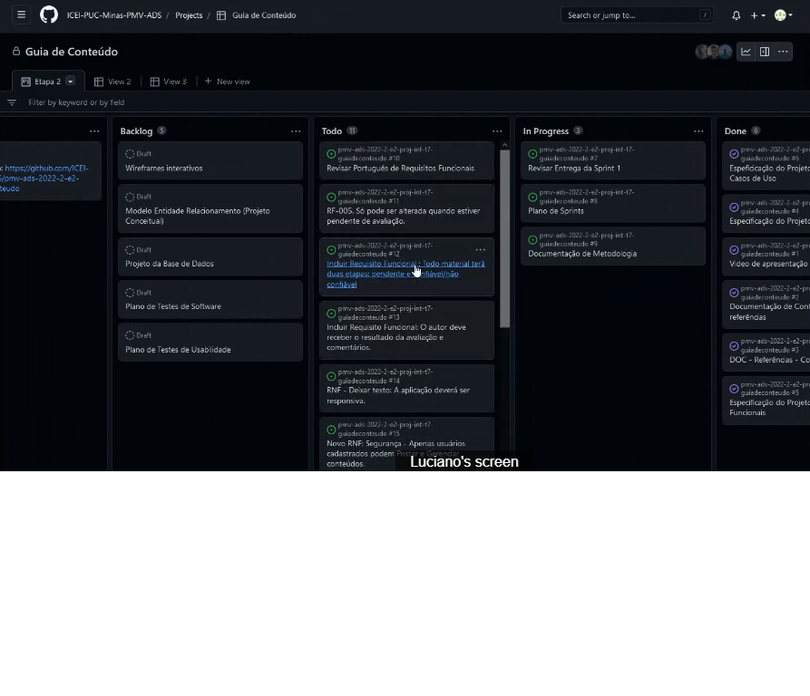

# Metodologia

A metodologia contempla as definições de ferramentas utilizadas pela equipe tanto para a manutenção dos códigos e demais artefatos quanto para a organização do time na execução das tarefas do projeto.

Posto isso, as ferramentas utilizadas para o desenvolvimento da aplicação e gerenciamento do projeto estão listadas abaixo.

## Relação de Ambientes de Trabalho

Os artefatos do projeto são criados com base nas diversas plataformas e a conexão dos ambientes com sua respectiva finalidade é introduzida na tabela abaixo.

| AMBIENTE                          | PLATAFORMA E LINK DE ACESSO                                                                       |
| --------------------------------- | ------------------------------------------------------------------------------------------------- |
| Repositório de código fonte       | [GitHub](https://github.com/ICEI-PUC-Minas-PMV-ADS/pmv-ads-2022-2-e2-proj-int-t7-guiadeconteudo/) |
| Documentos do projeto             | [GitHub](https://github.com/ICEI-PUC-Minas-PMV-ADS/pmv-ads-2022-2-e2-proj-int-t7-guiadeconteudo/) |
| Projeto de Interface e Wireframes | (https://www.figma.com/file/r7PiehOMgGsTcpYtwp0lO6/Untitled)                                      |
| Gerenciamento do Projeto          | [GitHub Projects](https://github.com/orgs/ICEI-PUC-Minas-PMV-ADS/projects/76/)                    |

## Controle de Versão

A ferramenta de controle de versão adotada no projeto foi o
[Git](https://git-scm.com/), sendo que o [Github](https://github.com)
foi utilizado para hospedagem do repositório.

O projeto segue a seguinte convenção para o nome de branches:

- `main`: versão estável já testada do software
- `unstable`: versão já testada do software, porém instável
- `testing`: versão em testes do software
- `dev`: versão de desenvolvimento do software

Quanto à gerência de issues, o projeto adota a seguinte convenção para
etiquetas:

- `documentation`: melhorias ou acréscimos à documentação
- `bug`: uma funcionalidade encontra-se com problemas
- `enhancement`: uma funcionalidade precisa ser melhorada
- `feature`: uma nova funcionalidade precisa ser introduzida

## Gerenciamento de Projeto

### Divisão de Papéis

A equipe está organizada da seguinte maneira:

- **Scrum Master:**
- Sávio Andrade Roquette

- **Product Owner:**
- Mariana Júlia EStevam Corrêa

- **Equipe de Desenvolvimento:**
- Mariana Júlia EStevam Corrêa
- Gabriel Goncalves Morais
- Luciano Ribeiro do Prado
- Cristiano Ferreira de Mattos

- **Equipe de Design:**
- Isabela Aparecida dos Santos
- Cristiano Ferreira de Mattos

O quadro com as atividades, bem como o status de cada uma, está disponível para ser visualizado através da URL (https://github.com/orgs/ICEI-PUC-Minas-PMV-ADS/projects/76/views/1), e é apresentado, no estado atual, na figura abaixo:

### Processo

Para organização e distribuição das tarefas, será utilizado a ferramenta Projects do GitHub, estruturado conforme listado abaixo:

- **Backlog:** Representa as tarefas que não estão previstas para serem realizadas no sprint em andamento.
- **Todo:** Representa as tarefas que foram atribuídas para serem realizadas durante o sprint.
- **In progress:** Neste quadro estarão as tarefas que estão sendo realizadas.
- **Done:** nesta lista são colocadas as tarefas que passaram pelos testes e controle de qualidade e estão prontos para ser entregues ao usuário. Não há mais edições ou revisões necessárias, ele está agendado e pronto para a ação.
- **Test:** nesta lista são colocadas as funcionalidades que passarão pelos testes para serem entregues para o usuário.

### Ferramentas

Foram empregadas as seguintes ferramentas para a documentação:

- Editor de código: [Visual Studio Code](https://code.visualstudio.com/).
- Ferramentas de comunicação: [Whatsapp](https://www.whatsapp.com) e [jit.si](https://meet.jit.si/projeto2semestreturma7).
- Ferramenta de desenho de tela (_wireframing_): [Marvelapp](https://marvelapp.com/).
