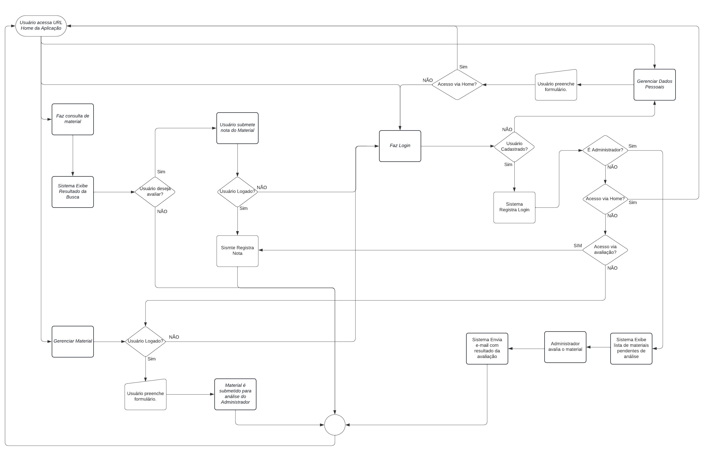

# Projeto de Interface

Pré-requisitos: <a href="2-Especificação do Projeto.md"> Documentação de Especificação</a>

Visão geral da interação do usuário pelas telas do sistema e protótipo interativo das telas com as funcionalidades que fazem parte do sistema (wireframes).

Apresente as principais interfaces da plataforma. Discuta como ela foi elaborada de forma a atender os requisitos funcionais, não funcionais e histórias de usuário abordados nas <a href="2-Especificação do Projeto.md"> Documentação de Especificação</a>.

## Diagrama de Fluxo

O diagrama apresenta o estudo do fluxo de interação do usuário com o sistema interativo.

## Wireframes

Tela principal sem estar logado. Contendo o botão "login", de "cadastro" e o "search" para busca.

Tela de login. Contendo o botão da Home e do cadastro.

Tela de cadastro. Contendo o botão "Home".

Tela estando logado. Contendo o botão "Upload", "Home" e "log out"

Tela do administrador. Contendo o botão para aceitar ou recusar a postagem e o "Search" para busca.

Tela de Upload e tela de edição. Contendo os botões "Conteúdo do curso", "Nome do Curso", "Resumo sobre o curso", "Publicar", "Excluir" e o botão para adicionar um print ou imagem relacionada ao curso.

