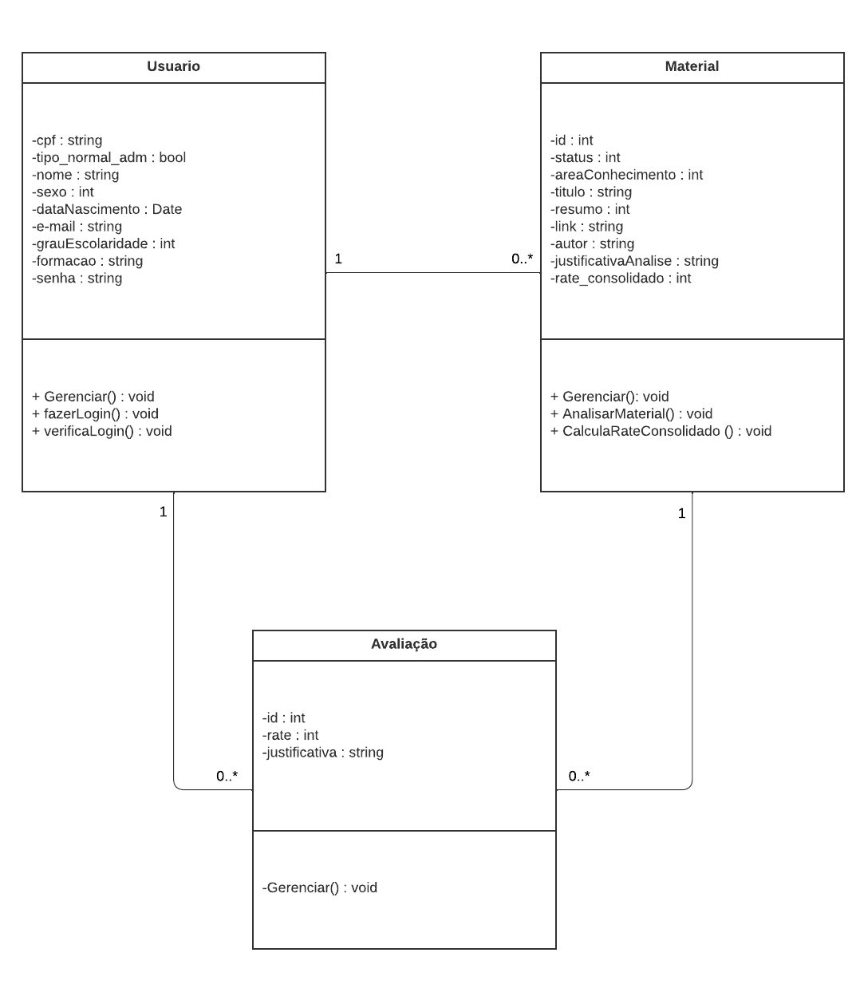
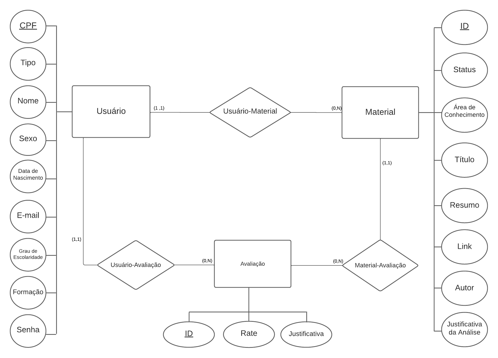
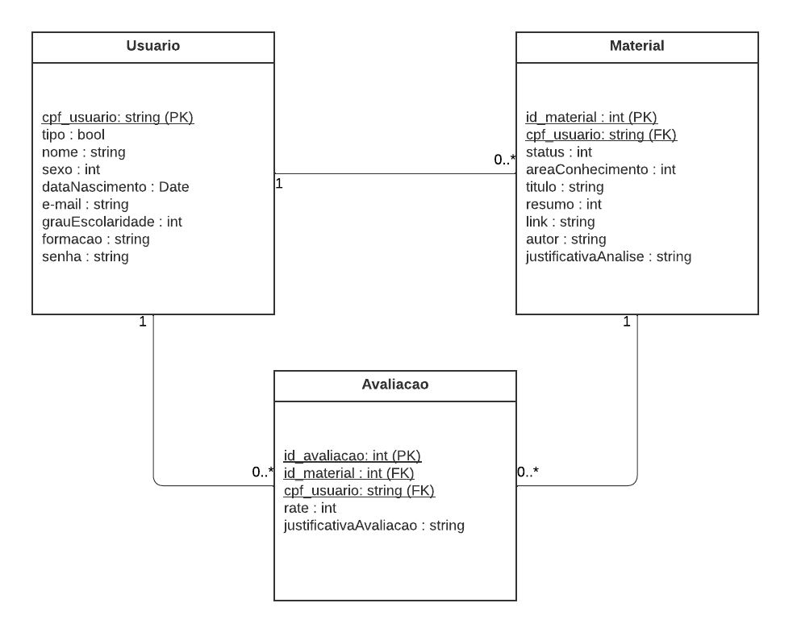

# Arquitetura da Solução

Pré-requisitos: <a href="3-Projeto de Interface.md"> Projeto de Interface</a>

Definição de como o software é estruturado em termos dos componentes que fazem parte da solução e do ambiente de hospedagem da aplicação.

## Diagrama de Classes

O diagrama de classes ilustra graficamente como será a estrutura do software, e como cada uma das classes da sua estrutura estarão interligadas. Essas classes servem de modelo para materializar os objetos que executarão na memória.

## Modelo ER (Projeto Conceitual)

O Modelo ER representa através de um diagrama como as entidades (coisas, objetos) se relacionam entre si na aplicação interativa.

## Projeto da Base de Dados

O projeto da base de dados corresponde à representação das entidades e relacionamentos identificadas no Modelo ER, no formato de tabelas, com colunas e chaves primárias/estrangeiras necessárias para representar corretamente as restrições de integridade.

 

## Tecnologias Utilizadas

IDEs de desenvolvimento: Visual Studio 2022;
Linguagens utilizadas: HTML, CSS, JavaScript, C#, MySql;
Ferramenta para modelagem do banco de dados:;
Ferramenta de design: Figma;
Plataforma para hospedagem dos arquivos: GitHub;
Ferramenta de versionamento: Git;
Ferramenta de divisão de tarefas: Github Project.

## Hospedagem

O site utiliza a ferramenta GitHub Pages pelo domínio github.io como ambiente de hospedagem do site do projeto, disponibilizado gratuitamente pelo próprio github. E Microsoft Azure - Microsoft SQL Server para a hospedagem do banco de dados, utilizando o credito que PUC Minas disponibilizou para estudos.
