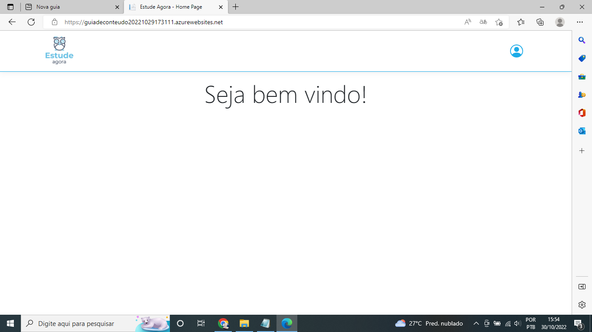
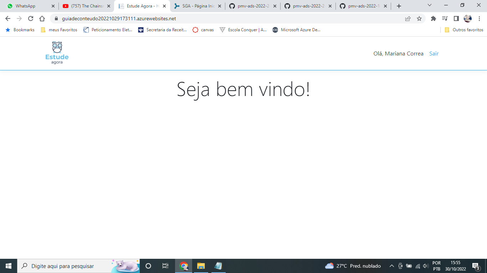

# Registro de Testes de Software

Registro de Testes de Software
Os resultados obtidos nos testes de software realizados são descritos na Tabela a seguir.

● Site publicado na Internet

● Navegador da Internet – Chrome e Edge

Os testes funcionais a serem realizados no aplicativo são descritos a seguir.

|  **Caso de Teste**  |  **CT-01  - Efetuar cadastro**  |
|--|--|
|Requisitos Associados:  |RF-03 - A aplicação deve possibilitar um usuário efetuar seu cadastro de forma eficiente  | 
|Objetivo do Teste:  | Verificar se o usuário consegue efetuar cadastro.  | 
|Passos:  | 1) Acessar a aplicação atraves do navegador
| |2) Clicar na imagem usuário  
| |3)clicar no icone "fazer cadastro" 
| |4) inserir as informações requeridas para  o cadastro
| |5) clicar no icone "fazer cadastro
| |6) visualizar mensagem de exito |
|Resultado:  | Aplicação concluída com sucesso|
|Evidência:  | |

https://user-images.githubusercontent.com/102702197/198898623-054e3087-c800-411c-80d1-5bc4ab3082f3.mp4 

|  **Caso de Teste**  |  **CT-02  - Efetuar Login**  |
|--|--|
|Requisitos Associados:  |RF-03 - A aplicação deve possibilitar um usuário efetuar seu cadastro de forma eficiente  | 
|Objetivo do Teste:  | Verificar se o usuário consegue efetuar login. | 
|Passos            	 |1) Acessar a aplicação atraves do navegador
|         |2) Clicar na imagem usuário  
|         |3) preencher dados de login
|         |4) clicar no icone "entrar"
|         |6) acessar area do usuário |
|Resultado:  | Aplicação concluída com sucesso|
|Evidência: |  |

https://user-images.githubusercontent.com/102702197/198898859-22be27db-80ab-4254-a9a8-933b03204eb5.mp4

| **Caso de Teste** 	| **CT-03 – Pesquisa de material** 	|
|:---:	|:---:	|
|	Requisito Associado 	| RF-001 - A aplicação deve possibilitar um usuário, cadastrado ou não, possa realizar pesquisa de material para estudo. |
| Objetivo do Teste 	| Verificar se o usuário consegue pesquisar o material. |
| Passos 	| 1- Acessar a aplicação atraves do navegador   2- Clicar na barra de pesquisa    3- Informar o nome do material a ser buscado   4- Clicar em "Buscar" |
|Critério de Êxito | - A pesquisa foi bem sucedida. |
|Resultado:  | Aplicação sem sucesso, não existe na aplicação local para efetuar a pesquisa de materiais pelo usuário|
|Evidência: |  |

https://user-images.githubusercontent.com/102702197/204152114-85a7c53b-a6f5-4d75-bf9f-4662a6d79735.mp4

| **Caso de Teste** 	| **CT-04 – Filtro de pesquisa** 	|
|:---:	|:---:	|
|	Requisito Associado 	| RF-002 - A aplicação deve oferecer uma funcionalidade de filtro de pesquisa do material de forma especifica para usuários cadastrado ou não. |
| Objetivo do Teste 	| Verificar se o usuário consegue filtrar o material desejado. |
| Passos 	| 1- Clicar na barra de filtros    2- Informar a categoria desejada   3- Clicar em "Buscar" |
|Critério de Êxito | - A pesquisa conseguiu filtrar os resultados. |
|Resultado:  | Aplicação sem sucesso, não existe na aplicação local para efetuar  filtro de materiais pesuisado pelo usuário|
|Evidência: |  |

https://user-images.githubusercontent.com/102702197/204152096-1e587eb2-9236-4a82-bd6c-42a06ea6796f.mp4

| **Caso de Teste** 	| **CT-05 – Gerenciamento de dados do usuário**	|
|:---:	|:---:	|
|Requisito Associado | RF-003	- A aplicação deve permitir que o usuário possa gerenciar seus dados. Para realizar o cadastro o usuário deverá fornecer pelo menos os seguintes dados: nome, CPF, data de nascimento, formação academica, e-mail e senha e exclui-los |
| Objetivo do Teste 	| Verificar se o usuário consegue gerenciar seus dados. |
| Passos 	| - Clicar em "Informações pessoais"   - Clicar em alterar informações   - Preencher os campos obrigatórios (nome, sexo, CPF, data de nascimento, formação academica, e-mail e senha.)   - Clicar em "Salvar alterações" |
|Critério de Êxito | - As alterações foram realizadas com sucesso. |
|Resultado:  | Aplicação com sucesso, foi possivel alterar os dados do usuário e excluir o cadastro|
|Evidência: |  |

https://user-images.githubusercontent.com/102702197/204152075-4ff02187-76ca-422d-b8a7-0938d4f522f3.mp4

| **Caso de Teste** 	| **CT-05 – Inclusão dos materiais**	|
|:---:	|:---:	|
|Requisito Associado | RF-005	- A aplicação deve possibilitar que um usuário cadastrado possa incluir e GERENCIAR uma referência de material para consulta, enquanto o status de seu material ainda estiver pendente, contendo pelo menos os seguintes campos: Título do material, área do conhecimento, resumo, link de acesso. |
| Objetivo do Teste 	| Verificar se o usuário cadastrado consegue incluir o material enquanto seu status ainda está pendente. |
| Passos 	| 1- Clicar no material   2- Verificar se está pendente   3- Preencher os campos (Título do material, área do conhecimento, resumo, link de acesso)   4- Clicar em "Enviar" |
|Critério de Êxito | - O usuário conseguiu incluir o material. |
|Resultado:  | Aplicação com sucesso, foi possivel incluir o material|
|Evidência: |  |

https://user-images.githubusercontent.com/102702197/204152057-81e11979-991b-4707-8dbb-647569c31c56.mp4

| **Caso de Teste** 	| **CT-07 – Avaliação de material**	|
|:---:	|:---:	|
|Requisito Associado | RF-004	-A aplicação deve possibilitar que um usuário cadastrado possa avaliar o material pesquisado. |
| Objetivo do Teste 	| Verificar se o usuário consegue avaliar o material. |
| Passos 	| 1- Clicar no material   - Clicar em "avaliar o material"   2- Preencher os campos obrigatórios (comentário e avaliação)   3- Clicar em "Enviar" |
|Critério de Êxito | - O usuário conseguiu avaliar o material. | 
|Resultado:  | Aplicação com sucesso, indentificando o material pelo seu id é possivel avalia-lo |
|Evidência: |  |

https://user-images.githubusercontent.com/102702197/204152471-4e5a5472-e0d2-4189-8a63-d45adf9feb31.mp4

| **Caso de Teste** 	| **CT-08 – Gerenciamento de materiais pendentes**	|
|:---:	|:---:	|
|Requisito Associado | RF-005	- A aplicação deve possibilitar que um usuário cadastrado possa incluir e GERENCIAR uma referência de material para consulta, enquanto o status de seu material ainda estiver pendente, contendo pelo menos os seguintes campos: Título do material, área do conhecimento, resumo, link de acesso. |
| Objetivo do Teste 	| Verificar se o usuário cadastrado consegue gerenciar o material enquanto seu status ainda está pendente. |
| Passos 	| 1- Clicar no material   2- Verificar se está pendente   3- Alterar os campos (Título do material, área do conhecimento, resumo, link de acesso)   4- Clicar em "Alterar" |
|Critério de Êxito | - O usuário conseguiu gerenciar o material. |
|Resultado:  | Aplicação com sucesso, foi possivel gerenciar o material, modificando seu título |
|Evidência: |  |

https://user-images.githubusercontent.com/102702197/204152609-14922a3c-c5af-4d09-85da-7144b7c435ba.mp4

| **Caso de Teste** 	| **CT-09 – Materiais em análise**	|
|:---:	|:---:	|
|Requisito Associado | RF-006	-A aplicação deverá permitir que o Administrador visualize todos os materiais submetidos para análise. |
| Objetivo do Teste 	| Verificar se o administrador consegue visualizar os materiais em análise. |
| Passos 	| - Ir até os materiais em análise   - A aplicação deve exibir a listagem de materiais para avaliação |
|Critério de Êxito | - O administrador conseguiu visualizar todos os materiais submetidos para análise. |
|Resultado:  | Aplicação sem sucesso, não existe na aplicação acesso ao administrador |

| **Caso de Teste** 	| **CT-10 – Avaliação de materiais como confiáveis**	|
|:---:	|:---:	|
|Requisito Associado | RF-007	-A aplicação deve possibilitar que uma referência de material seja avaliado como confiável ou não confiável pelos administradores. |
| Objetivo do Teste 	| Verificar se o administrador consegue avaliar os materiais como confiáveis ou não confiáveis. |
| Passos 	| - Se for adm   - Selecionar um material   - Clicar em avaliar como administrador   - Definir material como confiável ou não confiável.|
|Critério de Êxito | - O administrador consegue avaliar material como confiável ou não confiável. |
|Resultado:  | Aplicação sem sucesso, não existe na aplicação acesso ao administrador |

| **Caso de Teste** 	| **CT-11 – Notificar autor**	|
|:---:	|:---:	|
|Requisito Associado | RF-008	-A aplicação deve notificar o autor do conteúdo por e-mail sobre a aprovação/veto do seu conteúdo. |
| Objetivo do Teste 	| Verificar se o e-mail foi enviado com êxito. |
| Passos 	| - Clicar em "material aprovado"   - Verificar se a notificação foi enviada.|
|Critério de Êxito | - O e-mail foi enviado com sucesso. |
|Resultado:  | Aplicação sem sucesso, o email não foi enviado |

| **Caso de Teste** 	| **CT-12 – Duas etapas**	|
|:---:	|:---:	|
|Requisito Associado | RF-009	-Todo material terá duas etapas: Pendente e confiável/não confiável. |
| Objetivo do Teste 	| Verificar se o material possui as duas etapas (Pendente e confiável/não confiável). |
| Passos 	| - Clicar no material   - Ver status do material   - Verificar se o material possui pelo menos uma das etapas.|
|Critério de Êxito | - O material possui uma das duas etapas. |
|Critério de Êxito | - O e-mail foi enviado com sucesso. |
|Resultado:  | Aplicação sem sucesso,  o material não possui as duas etapas (Pendente e confiável/não confiável). |

 
| **Caso de Teste** 	| **CT-13 – Materiais confiaveis**	|
|:---:	|:---:	|
|Requisito Associado | RF-010	-Somente materiais avaliados como confiável poderá ser exibido no campo de pesquisa. |
| Objetivo do Teste 	| Verificar se apenas materiais avaliados aparecem no campo de pesquisa. |
| Passos 	| - Clicar na barra de pesquisa   - Digitar o nome do material.   - Verificar se aparecem apenas materiais avaliados como confiáveis. |
|Critério de Êxito | - Apenas materiais confiáveis são exibidos. |
|Resultado:  | Aplicação sem sucesso,  não existe campo de psquisa |
|Evidência: |  |

https://user-images.githubusercontent.com/102702197/204152114-85a7c53b-a6f5-4d75-bf9f-4662a6d79735.mp4

| **Caso de Teste** 	| **CT-14 – Recomendações da LGPD**	|
|:---:	|:---:	|
|	Tipo de teste:	| Não funcional |
|Requisito Associado | RNF-001	-A aplicação deve obedecer às recomendações da LGPD. |
| Objetivo do Teste 	| Verificar se aplicação se encaixa nas normas da LGPD. (Não tranferir a entidades privadas, sem consentimento do titular, dados pessoais constantes de bases a que tenha acesso.)|
| Passos 	| - Verificar recomendações da LGPD.   - Alterar as partes da aplicação que não obedecem as normas. |
|Resultado:  | Aplicação concluída com sucesso|

| **Caso de Teste** 	| **CT-15 – Compatibilidade com os navegadores**	|
|:---:	|:---:	|
|	Tipo de teste:	| Não funcional |
|Requisito Associado | RNF-002	-A aplicação deve ser compatível com os principais navegadores do mercado (Google Chrome, Firefox, Microsoft Edge). |
| Objetivo do Teste 	| Verificar se aplicação é compatível com os nevegadores (Google Chrome, Firefox, Microsoft Edge). |
| Passos 	| - Verificar a aplicação se adequa aos principais navegadores do mercado.|
|Resultado:  | Aplicação concluída com sucesso|
|Evidência:  |  |
|            |  |

https://www.loom.com/share/bf2b626a57664b53a2d849a248c7920a

| **Caso de Teste** 	| **CT-16 – Responsividade**	|
|:---:	|:---:	|
|	Tipo de teste:	| Não funcional |
|Requisito Associado | RNF-004	-A aplicação deverá ser responsiva. |
| Objetivo do Teste 	| Verificar se aplicação é responsiva. |
| Passos 	| - Verificar a responsividade da aplicação.|
|Resultado:  | Aplicação concluída com sucesso|
|Evidência:  | |

| **Caso de Teste** 	| **CT-17 – API de envio de e-mail**	|
|:---:	|:---:	|
|	Tipo de teste:	| Não funcional |
|Requisito Associado | RNF-006	-Deverá ser usado uma API para que a aplicação notifique por e-mail os usuários sobre o resultado do material submetido.	 |
| Objetivo do Teste 	| Verificar se API notifica os usuários sobre o resultado do material submetido. |
| Passos 	| - - Clicar em "material aprovado"   - Verificar se a notificação foi enviada.|
|Critério de Êxito | - A API notificou com sucesso. |
|Resultado:  | Aplicação sem sucesso,  não foi usado uma API |

# Relatório Geral do Teste de Softwere
