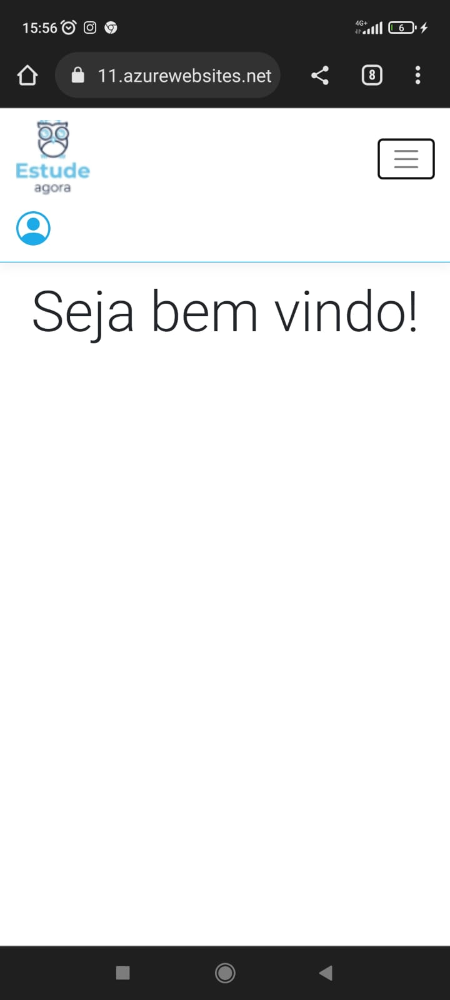

# Registro de Testes de Software

Registro de Testes de Software
Os resultados obtidos nos testes de software realizados são descritos na Tabela a seguir.

● Site publicado na Internet

● Navegador da Internet – Chrome e Edge

Os testes funcionais a serem realizados no aplicativo são descritos a seguir.

|  **Caso de Teste**  |  **CT-01  - Efetuar cadastro**  |
|--|--|
|Requisitos Associados:  |RF-03 - A aplicação deve possibilitar um usuário efetuar seu cadastro de forma eficiente  | 
|Objetivo do Teste:  | Verificar se o usuário consegue efetuar cadastro.  | 
|Passos:  | 1) Acessar a aplicação atraves do navegador
| |2) Clicar na imagem usuário  
| |3)clicar no icone "fazer cadastro" 
| |4) inserir as informações requeridas para  o cadastro
| |5) clicar no icone "fazer cadastro
| |6) visualizar mensagem de exito |
|Resultado:  | Aplicação concluída com sucesso|
|Evidência:  | |

https://user-images.githubusercontent.com/102702197/198898623-054e3087-c800-411c-80d1-5bc4ab3082f3.mp4 

|  **Caso de Teste**  |  **CT-02  - Efetuar Login**  |
|--|--|
|Requisitos Associados:  |RF-03 - A aplicação deve possibilitar um usuário efetuar seu cadastro de forma eficiente  | 
|Objetivo do Teste:  | Verificar se o usuário consegue efetuar login. | 
|Passos            	 |1) Acessar a aplicação atraves do navegador
|         |2) Clicar na imagem usuário  
|         |3) preencher dados de login
|         |4) clicar no icone "entrar"
|         |6) acessar area do usuário |
|Resultado:  | Aplicação concluída com sucesso|
|Evidência: |  |

https://user-images.githubusercontent.com/102702197/198898859-22be27db-80ab-4254-a9a8-933b03204eb5.mp4

| **Caso de Teste** 	| **CT-03 – Pesquisa de material** 	|
|:---:	|:---:	|
|	Requisito Associado 	| RF-001 - A aplicação deve possibilitar um usuário, cadastrado ou não, possa realizar pesquisa de material para estudo. |
| Objetivo do Teste 	| Verificar se o usuário consegue pesquisar o material. |
| Passos 	| 1- Acessar a aplicação atraves do navegador   2- Clicar na barra de pesquisa    3- Informar o nome do material a ser buscado   4- Clicar em "Buscar" |
|Critério de Êxito | - A pesquisa foi bem sucedida. |
|Resultado:  | Aplicação sem sucesso, não existe na aplicação local para efetuar a pesquisa de materiais pelo usuário|
|Evidência: |  |

https://user-images.githubusercontent.com/102702197/204150912-13bec82b-276f-4ad1-ac82-fc38bd1cc541.mp4

| **Caso de Teste** 	| **CT-14 – Recomendações da LGPD**	|
|:---:	|:---:	|
|	Tipo de teste:	| Não funcional |
|Requisito Associado | RNF-001	-A aplicação deve obedecer às recomendações da LGPD. |
| Objetivo do Teste 	| Verificar se aplicação se encaixa nas normas da LGPD. (Não tranferir a entidades privadas, sem consentimento do titular, dados pessoais constantes de bases a que tenha acesso.)|
| Passos 	| - Verificar recomendações da LGPD.   - Alterar as partes da aplicação que não obedecem as normas. |
|Resultado:  | Aplicação concluída com sucesso|

| **Caso de Teste** 	| **CT-15 – Compatibilidade com os navegadores**	|
|:---:	|:---:	|
|	Tipo de teste:	| Não funcional |
|Requisito Associado | RNF-002	-A aplicação deve ser compatível com os principais navegadores do mercado (Google Chrome, Firefox, Microsoft Edge). |
| Objetivo do Teste 	| Verificar se aplicação é compatível com os nevegadores (Google Chrome, Firefox, Microsoft Edge). |
| Passos 	| - Verificar a aplicação se adequa aos principais navegadores do mercado.|
|Resultado:  | Aplicação concluída com sucesso|
|Evidência:  |  |
|            |  |

| **Caso de Teste** 	| **CT-16 – Responsividade**	|
|:---:	|:---:	|
|	Tipo de teste:	| Não funcional |
|Requisito Associado | RNF-004	-A aplicação deverá ser responsiva. |
| Objetivo do Teste 	| Verificar se aplicação é responsiva. |
| Passos 	| - Verificar a responsividade da aplicação.|
|Resultado:  | Aplicação concluída com sucesso|
|Evidência:  | |

